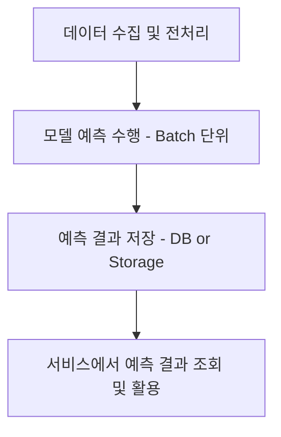
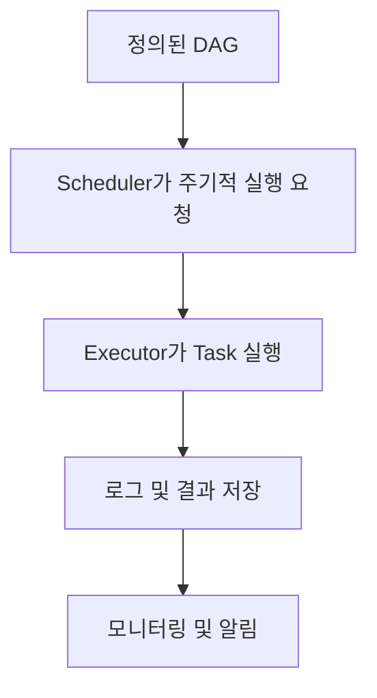

# ⚙️ Product Serving: Batch Serving과 Apache Airflow

> 이 문서는 Batch Serving의 개념과 논리를 중심으로 정리된 내용입니다.  
> 목표: “어떻게(How)”보다 “왜(Why)”와 “무엇(What)”에 초점을 맞춰,  
> 실무 적용 전 **Batch Serving의 본질적인 목적과 구조적 이해**를 돕는 것에 있습니다.

---

## 📍 1. Batch Serving의 개념

### 🧠 정의
- **Batch Serving**은 일정 기간 동안 데이터를 모아 한 번에 모델 예측을 수행하는 방식입니다.  
- 실시간 요청(Online Serving)과 달리, **시간 주기별로 일괄 처리(Batch Processing)**를 수행하여 예측 결과를 저장해 두고 필요 시 서비스가 이를 조회합니다.

> 즉, “**한 번에 많은 데이터를 효율적으로 처리**”하는 구조입니다.

---

### 🧩 Batch Serving이 필요한 이유

1. **효율성(Efficiency)**  
   - 실시간 요청이 아닌, 한 번의 대량 연산으로 예측을 수행하므로 연산 자원 절약.
   - 모델 로드 및 예측 과정을 여러 번 반복하지 않아도 됨.

2. **비용 절감(Cost Reduction)**  
   - 실시간 서버 유지 비용보다 훨씬 저렴.
   - 클라우드 인스턴스를 일정 주기(예: 매일 새벽)에만 켜서 사용 가능.

3. **실시간성이 중요하지 않은 문제 해결에 적합**  
   - 예: 하루에 한 번 갱신되는 추천 리스트, 상품 재고 예측, 매출 예측 등.

---

### 💡 Batch Serving의 동작 흐름

- 데이터는 특정 주기로 모아지고,
- 모델은 한 번 로드되어 모든 입력 데이터에 대해 예측을 수행,
- 결과는 DB나 파일 형태로 저장되어,  
  **서비스(프론트엔드)**는 예측을 직접 수행하지 않고 **저장된 결과를 조회**만 함.

---

## 🧭 2. Batch Serving의 구조적 논리

| 구성 요소 | 역할 | 설명 |
|------------|------|------|
| **Data Source** | 입력 데이터 | 분석 혹은 예측 대상 데이터 |
| **Batch Job** | 핵심 처리 단위 | 모델을 로드하고 일괄 예측을 수행하는 코드 |
| **Scheduler (스케줄러)** | 실행 타이밍 관리 | 예측 주기(예: 매일 0시)를 자동으로 실행 |
| **Storage** | 예측 결과 저장소 | DB, DW, S3 등 — 서비스가 조회할 위치 |
| **Service** | 결과 활용 | 사용자 화면에 예측 결과를 반영 |

> 핵심은 “예측을 언제, 어떻게 실행할 것인가”를 **자동화(Scheduling)** 하는 데 있습니다.

---

## 📊 3. Batch Serving의 활용 예시

| 유형 | 예시 | 설명 |
|------|------|------|
| 🛒 **수요 예측** | 매장별 제품 수요 | 매일 1회 예측 수행, 결과를 DB에 저장 |
| 🖼️ **이미지 분류** | 이미지 일괄 판별 | S3에 저장된 이미지 전체를 일괄 분석 |
| 💬 **자연어 분석** | 감정 분석, 키워드 추출 | 수집된 텍스트 데이터를 하루 단위로 처리 |

> 실시간성보다 **정확성과 안정성**이 더 중요한 상황에서 탁월합니다.

---

## 🧱 4. Batch Serving vs Online Serving

| 구분 | Batch Serving | Online Serving |
|------|----------------|----------------|
| 처리 시점 | 주기적 (일괄) | 요청 시 (실시간) |
| 속도 | 느리지만 안정적 | 빠르지만 리소스 부담 큼 |
| 비용 | 저렴 | 비쌈 |
| 복잡도 | 낮음 | 높음 |
| 예시 | 매일 상품 추천 갱신 | 사용자가 앱 실행 시 즉시 추천 |

> 두 방식은 상호 배타적이지 않고, **혼합형(하이브리드 구조)**으로 사용되기도 함.

---

## 🧠 5. Apache Airflow: Batch Serving의 핵심 스케줄러

### 5.1 Airflow의 본질적 역할

- Airflow는 단순히 “코드를 실행하는 도구”가 아니라,  
  **데이터 파이프라인 전체의 흐름(Workflow)을 논리적으로 설계하고 관리하는 시스템**입니다.

> 즉, Batch Serving을 **자동화된 일정 기반 프로세스(DAG)**로 구현하도록 돕는 핵심 인프라.

---

### 5.2 Airflow의 핵심 개념 (논리 중심)

| 개념 | 설명 |
|------|------|
| **DAG (Directed Acyclic Graph)** | 파이프라인의 전체 흐름을 표현한 논리 구조. 각 Task 간의 순서와 의존 관계를 정의. |
| **Task** | 실행해야 하는 단일 작업 (예: 데이터 수집, 모델 예측, 결과 저장). |
| **Operator** | Task의 동작 방식을 정의하는 추상화 단위 (예: PythonOperator, BashOperator 등). |
| **Scheduler** | DAG을 시간 기반으로 주기적으로 실행하도록 제어. |
| **Executor** | 실제 Task 실행을 담당하는 환경 (로컬, 쿠버네티스, Celery 등). |

> Airflow는 "무엇을 언제 실행할 것인가"에 대한 **논리적 제어 장치** 역할을 수행합니다.

---

### 5.3 Airflow의 개념적 동작 흐름

- DAG 파일에 파이프라인의 **논리적 구조**를 정의하고,
- Scheduler가 주기에 맞춰 Task를 실행,
- 결과는 모니터링되고 기록됩니다.

---

## ⚖️ 6. Batch Serving과 Airflow의 관계

| 역할 | Batch Serving | Airflow |
|------|----------------|---------|
| 목적 | 주기적 예측 수행 | 예측을 정해진 주기로 실행하도록 제어 |
| 형태 | 모델 중심 | 스케줄링 중심 |
| 결과물 | 예측 결과 (DB 저장) | 실행 관리 및 로그 |
| 결합 예시 | Airflow DAG 내부에서 모델 예측 Job 실행 | `PythonOperator`로 Batch Job 호출 |

> Batch Serving이 “무엇을 할 것인지”라면,  
> Airflow는 “언제, 어떤 순서로 할 것인지”를 결정하는 뇌(Brain) 역할입니다.

---

## ✅ 7. Batch Serving의 장단점

| 구분 | 장점 | 단점 |
|------|------|------|
| **Batch Serving** | 대량 처리 효율적, 비용 저렴, 코드 재사용 용이 | 실시간성 부족, 스케줄 관리 필요 |
| **Airflow 기반 운영** | 파이프라인 구조화, 모니터링 가능, 확장성 우수 | 초기 설정 복잡, 시스템 규모 커질수록 관리 부담 |

---

## 🧩 8. 핵심 요약

- **Batch Serving**은 실시간보다는 효율성과 안정성을 중시하는 예측 방식이다.  
- **Airflow**는 이 Batch 예측 과정을 **논리적, 자동화된 파이프라인**으로 관리하는 역할을 한다.  
- 두 개념의 결합은 **운영 안정성과 유지보수성**을 크게 향상시킨다.  
- 궁극적으로 Batch Serving은 **“ML 모델을 일정한 리듬으로 운영화하는 방식”**이다.

---

> 💬 쉽게 말해  
> Airflow는 “알람시계”이고,  
> Batch Serving은 “정해진 시간마다 돌아가는 예측 기계”입니다.  
> Airflow가 **언제 예측할지 결정하고**,  
> Batch Serving이 **무엇을 예측할지 수행**합니다.
