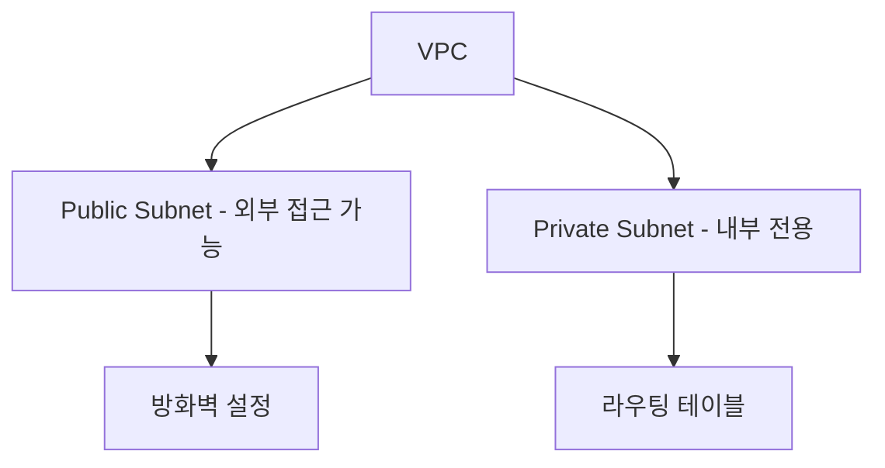
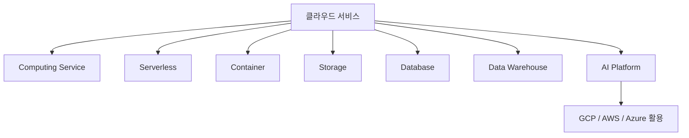

# ☁️ 07. 클라우드 서비스 (Cloud Service)

## **1. 클라우드 서비스를 사용하는 이유**

- **유연성과 확장성**  
  - 사용량에 따라 서버를 빠르게 추가하거나 줄일 수 있음.  
  - 갑작스러운 트래픽 증가에도 즉각적인 대응 가능.

- **비용 절감**  
  - 물리적 서버실(IDC)을 직접 운영하지 않아도 되며,  
    초기 장비 구입 및 유지보수 비용이 절감됨.

- **자동화된 관리**  
  - 클라우드 벤더(AWS, GCP, Azure 등)가 하드웨어 관리, 보안 패치, 백업 등을 자동 처리.

> ✅ **요약:** 필요한 만큼만 빌려 쓰는 유연한 서버 환경 제공

---

## **2. 클라우드 서비스의 다양한 제품**

| 분류 | 설명 | 예시 |
|------|------|------|
| **Computing Service (Server)** | CPU, 메모리, GPU 등을 선택해 가상 서버를 생성 및 운영 | AWS EC2 / GCP Compute Engine |
| **Serverless Computing** | 서버 관리 없이 코드만 업로드하면 자동으로 실행 | AWS Lambda / GCP Cloud Function |
| **Stateless Container** | Docker 기반 컨테이너 환경, Auto Scaling 지원 | AWS ECS / GCP Cloud Run |
| **Object Storage** | 파일·모델·로그 등 다양한 데이터를 저장 | AWS S3 / GCP Cloud Storage |
| **Database (DB)** | 관계형 데이터베이스 서비스 | AWS RDS / GCP Cloud SQL |
| **Data Warehouse** | 데이터 분석 및 BI용 저장소 | AWS Redshift / GCP BigQuery |
| **AI Platform** | 머신러닝 모델 개발, 배포를 위한 환경 | AWS SageMaker / GCP Vertex AI |

> ⚙️ 클라우드 제품 이름은 다르지만 기능은 유사 (예: S3 ≒ Cloud Storage)

---

## **3. 클라우드 서비스 공통 기술 개념**

- **Virtual Private Cloud (VPC)**  
  - 논리적으로 분리된 네트워크 공간  
  - 여러 서버를 한 네트워크로 묶어 보안성 강화  

- **Subnet**  
  - VPC 내의 세부 네트워크 구역  
  - Public Subnet: 외부 접근 가능  
  - Private Subnet: 내부 전용, 외부 접근 불가  

- **Routing (라우팅)**  
  - 네트워크 간 데이터의 이동 경로를 정의  
  - 실제 “표지판”과 같은 역할  

> 💡 예시 비유  
> VPC → 아파트 단지  
> Subnet → 거주 구역 / 상가 구역  
> Routing → 단지 내 표지판  

---

## **4. Cloud Network 핵심 개념**

- 클라우드 네트워크를 통해 **보안과 통신 효율을 동시에 확보**  
- AWS에서는 **Security Group**,  
  GCP에서는 **Network ACL** 로 방화벽을 설정  

---

## **5. Google Cloud Platform (GCP)**

### **5.1 GCP 기초 인프라 구성**

- **프로젝트 생성** → `project_name`, `project_id` 사용  
- **Compute Engine** → 가상머신(VM) 생성 및 관리  
- **무료 크레딧 ($300)** 제공 → 실습 부담 완화  
- GCP의 다양한 제품을 하나의 Dashboard에서 관리 가능  

---

### **5.2 GCP Compute Engine**

- **가상 머신(VM) 생성:** CPU, 메모리, 디스크 선택  
- **무료 티어(e2-micro)** 제공 → 소규모 학습 환경에 적합  
- **SSH 접속:** 브라우저에서 VM에 바로 접근 가능  
- **주의:** 사용 후 중지 또는 삭제 필요 (비용 절감 목적)

---

### **5.3 GCP Cloud Storage**

- **버킷(Bucket)** 생성 → Object Storage 역할  
- **파일 업로드 및 다운로드 가능**  
- **Python 연동 예시:**
  1. GCP Python SDK 설치  
  2. Service Account 생성 및 JSON 키 다운로드  
  3. 환경 변수 설정 후 인증  
  4. Blob API를 사용해 파일 업로드/다운로드 수행  

---

## **6. 클라우드 서비스의 장단점**

| 구분 | 장점 | 단점 |
|------|------|------|
| **Cloud Service** | 유연한 확장성, 초기 비용 절감, 관리 자동화 | 보안 설정 복잡, 비용 예측 어려움 |
| **GCP** | 오픈소스 친화적, 가격 대비 성능 우수 | AWS보다 커뮤니티 및 자료가 적음 |

---

## **7. 전체 구조 요약**

☁️ **클라우드는 인프라 관리의 자동화와 효율화를 가능하게 하며,  
개발자는 “서버 관리”가 아닌 “서비스 구현”에 집중할 수 있다.**

