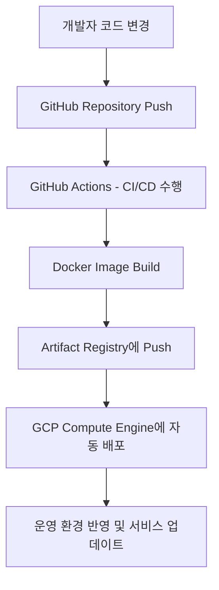

# 🚀 모델과 코드 배포

## **1. 환경 분리와 배포**

### **1.1 개발 환경의 구분**

- **Local (로컬 환경)**  
  개인 개발자가 자신의 컴퓨터에서 개발하는 환경.  
  Docker 등 컨테이너 기술을 활용해 팀 간 동일한 개발 환경을 유지할 수 있음.

- **Dev (개발 서버)**  
  로컬에서 완성된 기능을 올려 테스트하는 환경.  
  주로 내부 테스트용으로 사용되며, 지속적인 기능 검증에 활용됨.

- **Staging (스테이징 서버)**  
  운영 배포 전 단계. 실제 운영 환경과 거의 동일하게 구성되어  
  성능, 보안, 데이터 일관성을 사전에 검증하는 목적.

- **Production (운영 환경)**  
  실제 유저가 접속하는 서비스 환경.  
  높은 안정성과 신뢰성이 요구됨.

---

### **1.2 CI/CD 개념**

- **Continuous Integration (CI)**  
  코드 변경이 발생할 때마다 자동으로 빌드 및 테스트하여 품질을 보장.  
  코드 충돌을 빠르게 감지하고 오류를 조기에 발견할 수 있음.

- **Continuous Deployment / Delivery (CD)**  
  CI 이후의 단계를 자동화하여 배포까지 연결.  
  Merge 시 자동으로 서버에 반영되며, Git Flow 기반 브랜치 전략과 결합됨.  

  예:  
  `feature → dev → staging → main (production)`  

---

## **2. GitHub Actions**

### **2.1 소개**

- **GitHub Actions**는 코드 빌드, 테스트, 배포 등의 워크플로우를 자동화하는 CI/CD 도구.  
- 주요 개념 정리:
  - **Workflow**: YAML로 정의된 자동화 시나리오  
  - **Event**: 실행 조건 (예: push, pull_request)  
  - **Job**: 여러 개의 step으로 구성된 작업 단위  
  - **Step**: 명령 실행 단위  
  - **Action**: 재사용 가능한 step의 묶음

---

### **2.2 주요 활용 사례**

1. 테스트 코드 자동 실행 (단위/통합 테스트)
2. 코드 배포 자동화 (Docker Image Push, 서버 배포 등)
3. 주기적 작업 (데이터 수집, 리포트 생성)
4. 릴리즈 및 태깅 자동화

---

## **3. 모델 이미지 준비하기**

### **3.1 Dockerfile 작성**

- 모델 서빙용 API Endpoint를 포함한 Dockerfile 작성
- 예측 모델 실행에 필요한 모든 라이브러리 및 환경 설정 포함
- 주요 구성 요소:
  - `FROM`: 베이스 이미지 지정
  - `COPY`: 코드 및 모델 파일 복사
  - `RUN`: 의존성 설치 (requirements.txt 등)
  - `CMD`: 컨테이너 시작 명령

---

### **3.2 Docker Image Registry**

- Docker 이미지를 관리하기 위한 저장소.
- 예시:
  - Docker Hub
  - Google Cloud Artifact Registry

GCP에서의 기본 설정 절차:
1. Artifact Registry API 활성화  
2. gcloud CLI 인증  
   ```bash
   gcloud auth configure-docker


---

````markdown
# 🚀 모델과 코드 배포

## **3.3 Docker Image Build & Push**

```bash
docker build -t model_deploy:test .
docker tag model_deploy:test asia-northeast3-docker.pkg.dev/<project-id>/model-deploy/v1:latest
docker push asia-northeast3-docker.pkg.dev/<project-id>/model-deploy/v1:latest
````

* 이미지 빌드 → 태깅 → Artifact Registry로 Push
* 빌드 자동화를 위해 GitHub Actions와 연계 가능

---

## **3.4 자동화 (GitHub Actions 활용)**

* 특정 브랜치(main 등)에 Merge될 때
  자동으로 Docker 이미지를 빌드 및 Push하는 파이프라인 구성 가능

---

## **4. 배포하기**

### **4.1 GCP Compute Engine 세팅**

* GCP VM 인스턴스 생성 후 컨테이너 이미지를 기반으로 설정
* 권장 사양: `vCPU 4개`, `RAM 16GB` 이상

---

### **4.2 VM Instance에 새 이미지 배포**

```bash
gcloud compute instances update-container <instance-name> \
  --container-image <image-path>
```

* 기존 컨테이너를 최신 이미지로 교체
* 배포 과정 자동화를 위해 GitHub Actions와 연동 가능

---

### **4.3 배포 파이프라인 자동화 (예시)**

```yaml
jobs:
  deploy:
    runs-on: ubuntu-latest
    steps:
      - name: Deploy to GCP
        run: gcloud compute instances update-container <instance-name> --container-image <image-path>
```

---

## **5. 운영 단계에서의 고려사항**

### **5.1 모델 버저닝**

* 모델 버전을 명확히 관리해야 함 (`v1`, `v1.1`, `v2` 등)
* 롤백 시 필요한 버전 추적 가능해야 함
* 버전 정보는 모델 메타데이터나 환경 변수로 함께 관리

---

### **5.2 모델 아티팩트 관리**

* 대용량 모델 파일(`.pth`, `.h5` 등)은 Object Storage(S3, GCS)에 저장 권장
* 접근 권한 설정 필수 (읽기/쓰기 분리, 삭제 방지 등)

---

### **5.3 로그 관리**

* Docker 로그는 용량 초과 방지를 위해 순환(log rotation) 설정 필요
* 장기 보관 시 외부 스토리지(GCS, CloudWatch 등)에 전송

---

## **6. 요약**

* 환경은 `Local → Dev → Staging → Production` 순으로 점진적으로 확장
* **CI/CD**를 통해 코드의 품질과 배포 효율성을 모두 확보
* **GitHub Actions + Docker + GCP Artifact Registry**로 완전한 자동화 가능
* 모델 버전 및 로그 관리까지 포함하면 안정적 MLOps 파이프라인 완성

---

### **📊 전체 구조 요약**



> **핵심 요약:**
> CI/CD와 컨테이너화를 결합한 자동화된 모델 배포 시스템은
> “개발 속도”, “서비스 안정성”, “운영 효율성”을 동시에 확보할 수 있게 한다.

```

